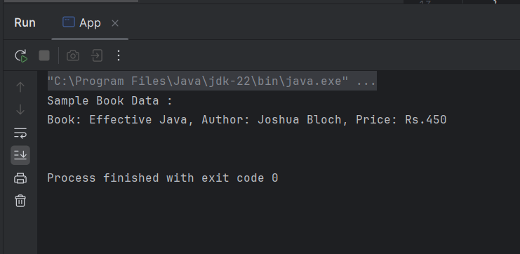

# Exercise 2: Implementing Dependency Injection

This exercise demonstrates setter-based Dependency Injection in Spring using XML configuration.

## Summary

- Modified the Spring project to wire `BookRepository` into `BookService` using setter injection.
- Updated the XML to include `<property>` configuration.
- Verified the injection by running the main class.

## Files

- 🔗 [BookService.java](./LibraryManagement/src/main/java/com/library/service/BookService.java)
- 🔗 [BookRepository.java](./LibraryManagement/src/main/java/com/library/repository/BookRepository.java)
- 🔗 [applicationContext.xml](./LibraryManagement/src/main/resources/applicationContext.xml)
- 🔗 [LibraryManagementApplication.java](./LibraryManagement/src/main/java/com/library/App.java)
- 🖼️ [output.png](./output.png)

## Output

- 
