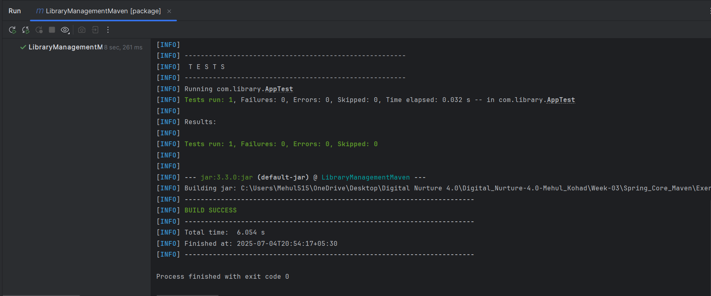
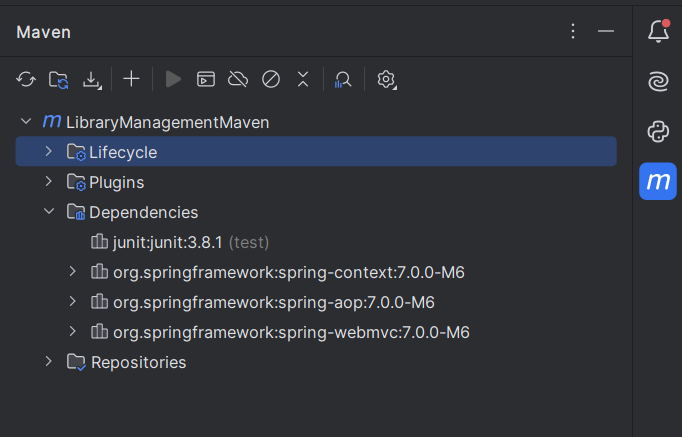

# Exercise 4: Creating and Configuring a Maven Project

This exercise demonstrates setting up a new Maven project and adding Spring dependencies manually.

## Summary

- Created a new Maven project.
- Added Spring Context, AOP, and WebMVC dependencies.
- Configured Maven Compiler Plugin for Java 1.8.
- Verified the successful project build.

## Files

- 🔗 [pom.xml](./LibraryManagementMaven/pom.xml)
- 🖼️ [output-1.png](./output-1.png)
- 🖼️ [output-2.png](./output-2.png)

## Output

- 
- 
