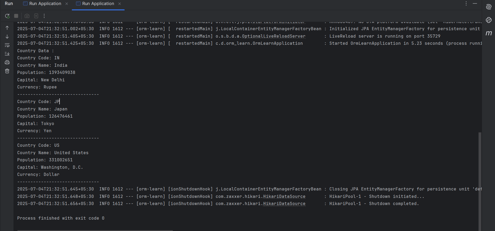

# Example 1: Spring Data JPA - Quick Example

This exercise demonstrates a simple Spring Boot application using Spring Data JPA.

## Summary

- Created a Spring Boot project (`orm-learn`).
- Configured MySQL database connection in `application.properties`.
- Created `Country` entity and `CountryRepository`.
- Fetched and displayed a list of countries from the database.

## Files

- 🔗 [Country.java](./orm-learn/src/main/java/com/deepskilling/orm_learn/model/Country.java)
- 🔗 [CountryRepository.java](./orm-learn/src/main/java/com/deepskilling/orm_learn/repository/CountryRepository.java)
- 🔗 [CountryService.java](./orm-learn/src/main/java/com/deepskilling/orm_learn/service/CountryService.java)
- 🔗 [OrmLearnApplication.java](./orm-learn/src/main/java/com/deepskilling/orm_learn/OrmLearnApplication.java)
- 🔗 [application.properties](./orm-learn/src/main/resources/application.properties)
- 🖼️ [output.png](./output.png)

## Output

- 
