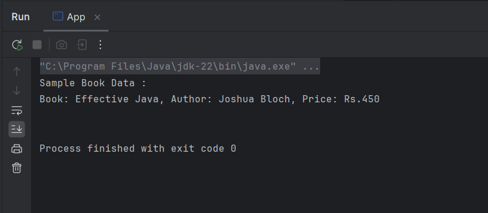

# Exercise 1: Configuring a Basic Spring Application

This exercise demonstrates creating a basic Spring application with XML configuration.

## Summary

- Configured a Spring Maven project named `LibraryManagement`.
- Added Spring Core dependencies in `pom.xml`.
- Defined beans (`BookService`, `BookRepository`) in `applicationContext.xml`.
- Verified bean creation and method calls.

## Files

- 🔗 [BookService.java](./LibraryManagement/src/main/java/com/library/service/BookService.java)
- 🔗 [BookRepository.java](./LibraryManagement/src/main/java/com/library/repository/BookRepository.java)
- 🔗 [applicationContext.xml](./LibraryManagement/src/main/resources/applicationContext.xml)
- 🔗 [LibraryManagementApplication.java](./LibraryManagement/src/main/java/com/library/App.java)
- 🖼️ [output.png](./output.png)

## Output

- 
